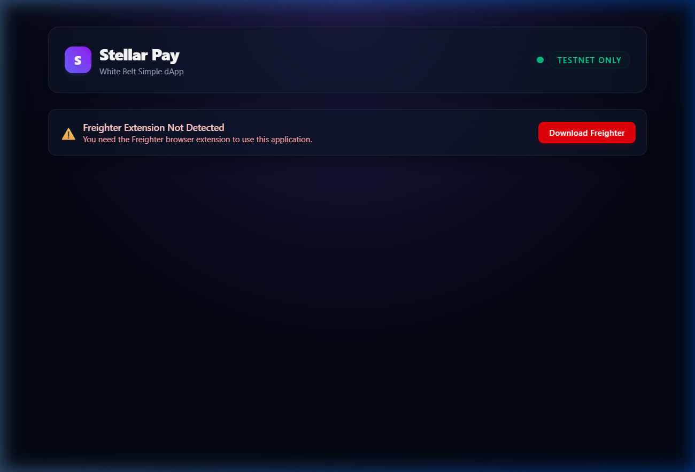

# Stellar Pay — Simple Payment dApp (Testnet)

A production-quality, beginner-scope Stellar decentralized application (dApp) built for the Stellar White Belt developer milestone. This application enables users to connect their Freighter browser wallet, fetch and display their XLM balance on the Stellar Testnet network, activate unfunded accounts via Friendbot, and send native payments to any other valid Stellar address with instant feedback.

## Features

- 🔌 **Freighter Wallet Integration**: Connect and disconnect the Freighter extension, view shortened addresses, and copy them to the clipboard.
- 🌐 **Network Detection & Warning**: Detects if Freighter is set to a non-Testnet network and displays a warning banner prompting the user to switch networks.
- 💰 **Real-Time Balance Display**: Queries the Horizon Testnet API to retrieve XLM balances, featuring loading skeletons and refresh animations.
- 🤖 **Friendbot Activation**: Gracefully handles unfunded accounts by offering an inline button to request 10,000 test XLM directly from Friendbot.
- 💸 **Transaction Form & Validation**: Input fields for destination address, XLM amount, and text memo with live client-side validations (address structure via `StrKey`, positive amounts, and reserve/fee limits).
- 📜 **Instant Feedback**: Displays detailed transaction details (hash, explorer links) on success or detailed error reasons extracted from Horizon extras on failure.
- 🎨 **Premium Modern Design**: Built with a responsive glassmorphic dark-theme UI.

## Tech Stack

- **Frontend**: React 19, Vite, TypeScript
- **Styling**: Tailwind CSS v4 (Glassmorphism & animations)
- **Stellar Libraries**:
  - `@stellar/stellar-sdk` (Horizon Client, Transaction Builder, Operations, Memos)
  - `@stellar/freighter-api` (Wallet status, Address retrieval, Transaction signing)

---

## Installation & Setup Instructions

### 1. Prerequisites
Ensure you have [Node.js](https://nodejs.org/) installed (v18+ recommended) and the [Freighter Wallet Browser Extension](https://www.freighter.app/) added to your web browser.

### 2. Clone the Repository
```bash
git clone <repository-url>
cd stellar-payment-dapp
```

### 3. Install Dependencies
```bash
npm install
```

### 4. Configure Freighter Wallet
1. Open the Freighter extension in your browser.
2. Select **Settings** (gear icon) -> **Preferences**.
3. Set the active network to **Testnet** (Horizon URL: `https://horizon-testnet.stellar.org`).

### 5. Launch the Development Server
```bash
npm run dev
```
Open your browser and navigate to `http://localhost:5173`.

---

## Stellar Testnet Workflow

1. **Connect Wallet**: Click "Connect Wallet" on the dashboard.
2. **Fund / Activate**: If your account is new and unfunded, click the **"Activate with Friendbot"** button to receive 10,000 Testnet XLM.
3. **Send XLM**: Fill out the payment form with:
   - A valid recipient public key (e.g. starting with `G`).
   - The amount of XLM to send.
   - An optional text memo (max 28 characters).
4. **Sign & Submit**: Click "Submit Payment". Approve the transaction signature request in your Freighter extension popup.
5. **View Transaction**: Once submitted, you'll receive a success screen. Click **"View on Stellar.Expert"** to see your transaction on the block explorer.

---

## Screenshots

### Application Dashboard


> Note: To view the full transaction flow (Freighter popup, success banners, Friendbot activation), please connect your wallet locally and run the dApp.
